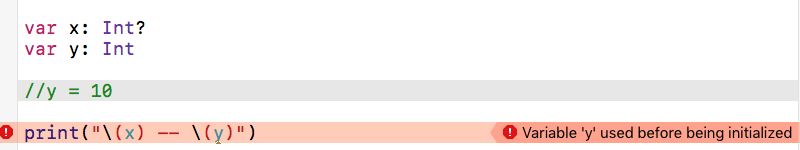

### Swift 可选型

[TOC]

　　可选类型用来表示值缺失的情况。我们可以在具体的值与 `nil` 之间做一个选择。

### 可选类型定义

```
var x : Int?
var y : Int
y = 10
print("\(x) -- \(y)") // 输出：nil -- 10
```

> `Int?` 与 `Int` 是两种完全不同的数据类型，前者为整型的可选行，后者是整型。

如果我们不给 `y` 赋值的话，程序将抛出错误。如下图：



　　因为如果声明了一个可选变量或者常量而没有赋值，则默认为 `nil` ，`nil` 不能用于非可选的常量或者变量。
　　其次，声明了一个非可选型的常量或者变量并没有赋值的之前，当我们输出的时候会抛出异常。


### 可选型的取值

#### 使用`!`进行强制解包

　　当确定可选类型确实包含值之后，可以在可选的名字后⾯加⼀个感叹号（ `!`  ）来获取值。这个感叹号表⽰“我知道这个可选有值，请使⽤它。”这被称为可选值的强制解析。

```
"The errorCode is " + errorCode! // The errorCode is 404
```
> **注意：** 这种写法是在明确知道了可选型不等于 `nil` 的情况下使用。如果可选型的值为 `nil` 则会抛出 **fatal error** 致命错误。

####  判断不是 `nil`
　　解包前对数据进行判断，如果不等于 `nil` 则进行解包操作。
```
var errorCode: String? = "404"

if errorCode != nil{
    "The errorCode is " + errorCode!
}else{
    "No Error"
}
```

####  `if-let` 解包

还可以给解包的值使用 `if let` 语句进行赋值。
```
var errorCode: String? = "404"

if let upwrappedErrorCode = errorCode{
    "The errorCode is " + upwrappedErrorCode
}else{
    "No Error"
}
```

#### 可以使用相同的变量名

也可以将上面的常量 `upwrappedErrorCode` 允许使用和 `errorCode` 一致的名称。
```
var errorCode: String? = "404"

if let errorCode = errorCode{
    "The errorCode is " + errorCode
}else{
    "No Error"
}
```
> 这种解包方式只能在 `{}` 中访问 `errorCode` 常量。

#### 使用 `if-let` 同时解包多个变量

如果存在两种或者多种需要解包判断的情况，我们可以使用更加优雅的写法
```
var errorCode: String? = "404"
var errorMessage: String? = "Not Found"

if let errorCode = errorCode , let errorMessage = errorMessage {
    "The errorCode is " + errorCode + "\nThe errorMessage is " + errorMessage
}

// 以上写法等同于
if let errorCode = errorCode {
    if let errorMessage = errorMessage {
        "The errorCode is " + errorCode + "\nThe errorMessage is " + errorMessage
    }
}
```

还可以新增一些判断条件，如下：
解包两个可选型，并判断 `errorCode` 的值是否等于 404 。
```
if let errorCode = errorCode , let errorMessage = errorMessage , errorCode == "404" {
    "page not found"
}
```


[TOC]
### 可选型


```
var errorMessage: String? = "Not Found"
errorMessage?.uppercased()
```
　　虽然 `errorMessage` 是一个可选型，这里尝试对他进行解包，如果解包成功（即不等于 `nil`）那么对他进行 `uppercased()` 操作；如果解包失败则不回执行 `uppercased()` 操作。
　　如果可选型 `errorMessage` 等于 `nil` ，则会返回 `nil`。

逻辑等同于如下写法

```
var errorMessage: String? = "Not Found"
if let errorMessage = errorMessage {
    errorMessage.uppercased()
}
```

另一种写法

```
errorMessage!.uppercased()
```

　　将可选型 `errorMessage` 进行强制解包，并调用 `uppercased()` 操作，如果可选型 `errorMessage` 等于 `nil` 将会抛出 **fatel error** 致命错误，这种写法一般情况下是不安全的，也是不推荐的。

```
var uppercaseErrorMessage = errorMessage?.uppercased() // 变量 `uppercaseErrorMessage` 是一个可选型
```

if let errorMessage = errorMessage?.uppercased() {
    errorMessage
}

// 上面的写法将解包和调用操作以及赋值基于一体，使逻辑更加清晰，减少代码的出错率


