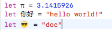

## Swift 基础

[TOC]

### Swift 常用数据类型
常用的数据类型有：整型（`Integer`）、浮点型（`Double`|`Float`）、布尔型（`Bool`）、字符串（`String`）、数组（`Array`）、集合（`Set`）、字典（`Dictionary`）、元组（`Tuple`）以及`nil`

### 变量与常量

#### 声明

常量的值一旦设定就不能改变，而变量的值可以随意更改。常量使用关键字 `let` 声明，变量使用关键字 `var` 声明，也可以在一行中声明多个常量或多个变量，使用 `,` 隔开。例如：
```
var x = 1,y = 2 ,z = 0.0 // 声明变量

let maxNum = 10 // 声明常量
```
> **注意：**
> 在实际开发使用中，如果代码中有不需要改变的值，建议使用 `let` 关键字将它声明为常量，只将需要改变的值声明为变量，使用 `var` 。

#### 类型标注
　　当声明常量或者变量时可以加上类型标注（`type annotation`），说明常量或者变量中要存储的值的类型。
　　声明方法是：在常量或者变量名后面加上一个冒号和空格，然后加上类型名称。如：
```
var name: String = "zhang"
let maxInt: UInt = 1844
```

> **注意：** 一般而言我们很少需要写类型标注。如果你在声明常量或者变量的时候赋了一个初始值，Swift可以推断出这个常量或者变量的类型。

#### 命名规范
我们可以使用任何喜欢的字符作为常量和变量名，包括Unicode字符,**但是在实际开发使用中不推荐这样写**。例如：

```
var 名字 = "curder"

print("我的名字是\(名字)") // 打印结果： 我的名字是curder

print("我的名字是" + 名字) // 打印结果： 我的名字是curder

var  = "哭"
```




> Mac 系统中使用 `command + control + space`可以呼出表情。 

　　常量与变量名不能包含数学符号，箭头，保留的（或者非法的）Unicode 码位，连线与制表符。也不能以数字开头，但是可以在常量与变量名的其他地方包含数字。

　　一旦将常量或者变量声明为确定的类型，就不能使用相同的名字再次进行声明，或者改变其存储的值的类型。同时，你也不能将常量与变量进行互转。

>　　如果需要使用与 Swift 保留关键字相同的名称作为常量或者变量名，你可以使用反引号（`）以关键字包围的方式将其作为名字使用。但是我们应当避免使用关键字作为常量或变量名，除非别无选择。

#### 输出
　　在 Swift 语言中，一些基础数据类型都可以使用 `print` 打印。
```
let x = 1 , y = true , z = 3
print( x , y , z )
```

##### 自定义分隔符(默认为空格) 

```
print( x , y , z , separator:"-") // 结果为：`1-true-3`
```
##### 自定义结束符(默认为 \n ) 

```
print( x , y , z , separator:"-",terminator:":)") // 结果为：1-true-3:)
```

##### 字符串插值
　　Swift 用字符串插值（string interpolation）的方式把常量名或者变量名当做占位符加入到长字符串中，Swift 会用当前常量或变量的值替换这些占位符。将常量或变量名放入圆括号中，并在开括号前使用反斜杠将其转义：

```
print("\(x) * \(z) = \(x * z)") // 1 * 3 = 3
```
#### 注释

* 单行注释 
```
//
```

* 多行注释
```
/*
这是一个多行注释
*/
```
　　与 C 语言多行注释不同，Swift 的多行注释可以嵌套在其它的多行注释之中。你可以先生成一个多行注释块，然后在这个注释块之中再嵌套成第二个多行注释。终止注释时先插入第二个注释块的终止标记，然后再插入第一个注释块的终止标记：

~~~
/* 这是第一个多行注释的开头
/* 这是第二个被嵌套的多行注释 */
这是第一个多行注释的结尾 */
~~~

通过运用嵌套多行注释，你可以快速方便的注释掉一大段代码，即使这段代码之中已经含有了多行注释块。


### 分号

与其他大部分编程语言不同，Swift 并不强制要求你在每条语句的结尾处使用分号（`;`），当然，你也可以按照你自己的习惯添加分号。有一种情况下必须要用分号，即你打算在同一行内写多条独立的语句：

~~~
let cat = "?"; print(cat)
// 输出 "?"
~~~